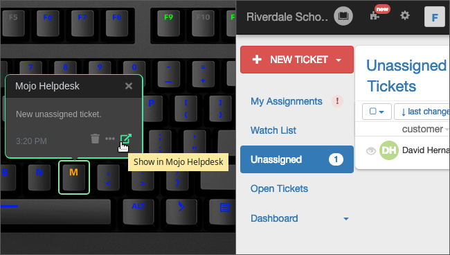

# Q Applet: Mojo Helpdesk

Displays new tickets activity on a Das Keyboard Q Series.

Mojo Helpdesk is the #1 help desk & ticket tracking software to provide great customer support.

For more information visit <https://mojohelpdesk.com/>.

[GitHub repository](https://github.com/daskeyboard/daskeyboard-applet--mojo-helpdesk)

## Example

## Changelog

[CHANGELOG.MD](CHANGELOG.md)

## Installation

Requires a Das Keyboard Q series: www.daskeyboard.com

Installation, configuration and uninstallation of applets is done within
the Q Desktop application (https://www.daskeyboard.com/q)

## Running tests

- `yarn test`

## Contributions

Pull requests welcome.

## Copyright / License

Copyright 2014 - 2019 Das Keyboard / Metadot Corp.

Licensed under the GNU General Public License Version 2.0 (or later);
you may not use this work except in compliance with the License.
You may obtain a copy of the License in the LICENSE file, or at:

   http://www.gnu.org/licenses/old-licenses/gpl-2.0.txt

Unless required by applicable law or agreed to in writing, software
distributed under the License is distributed on an "AS IS" BASIS,
WITHOUT WARRANTIES OR CONDITIONS OF ANY KIND, either express or implied.
See the License for the specific language governing permissions and
limitations under the License.
